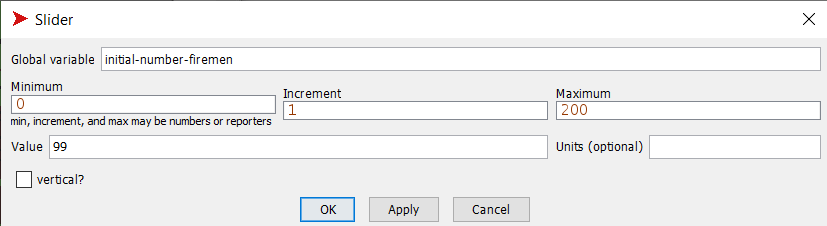
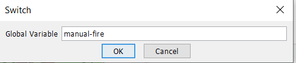
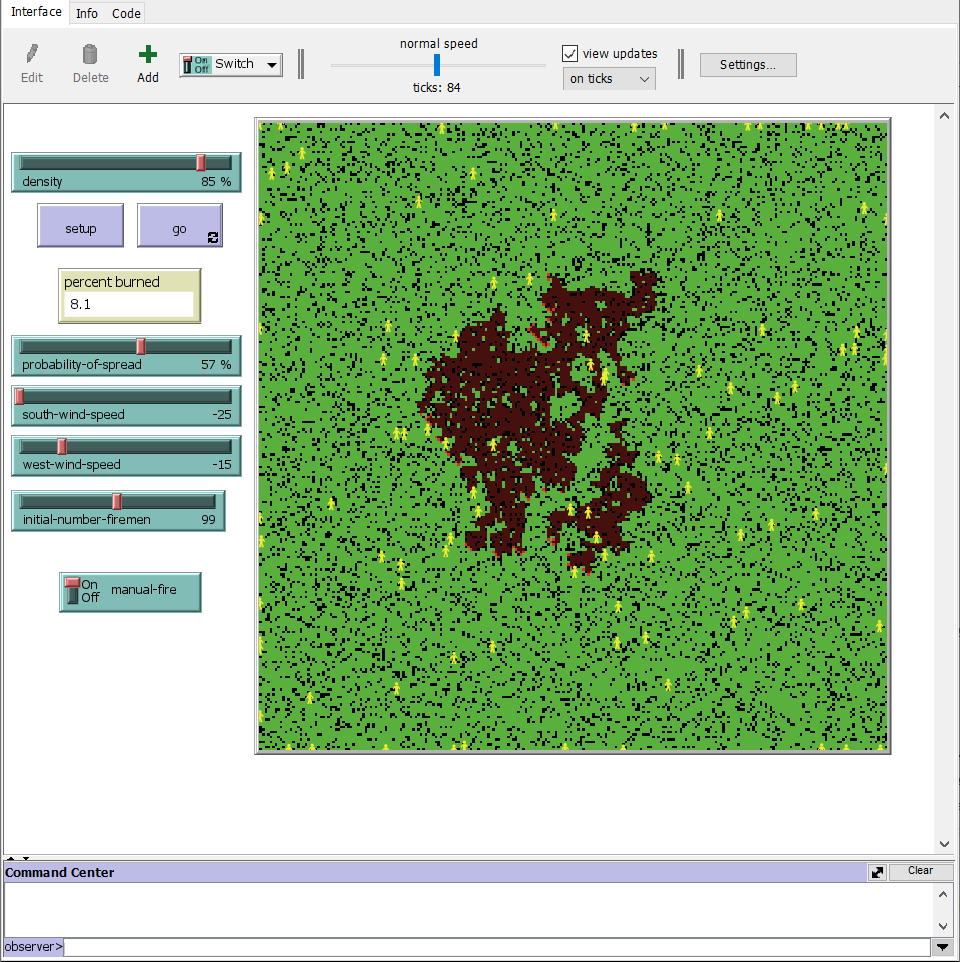
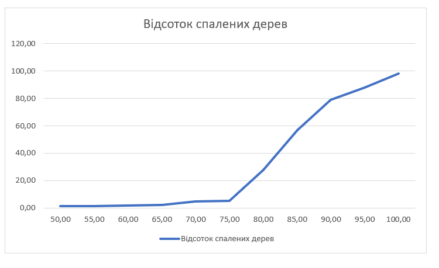

## Комп'ютерні системи імітаційного моделювання
## СПм-22-4, **Гаращенко Ярослав Володимирович**
### Лабораторна робота №**2**. Редагування імітаційних моделей у середовищі NetLogo

 

### Варіант 5, модель у середовищі NetLogo:
[Fire Simple Extension 2](http://www.netlogoweb.org/launch#http://www.netlogoweb.org/assets/modelslib/IABM%20Textbook/chapter%203/Fire%20Extensions/Fire%20Simple%20Extension%202.nlogo)

 

### Внесені зміни у вихідну логіку моделі, за варіантом:

**Додати агентів-"пожарних", кількість яких вказується користувачем.**
Агенти початково розміщені тільки на "пустих" клітинках (де нема дерев) випадковим чином і можуть переміщатися у випадковому напрямку, але тільки по тим плямам, що поки що не згоріли (мають зелений чи чорний колір).

Кількість агентів-"пожарних" визначається користувачем за допомогою слайдера initial-number-firemen:
<pre>
  initial-number-firemen
</pre>

Оголошено новий вид агентів з назвою"fireman".
<pre>
  breed [firemen fireman ]
</pre>

Ця процедура ініціалізує агентів-"пожарних" при початковій настройці моделі. Кількість агентів-"пожарних" перевіряється на випадок, якщо вона більша за кількість "пустих" клітинок, тобто тих, де немає дерев. У такому випадку кількість агентів обмежується кількістю "пустих" клітинок. Далі створюються агенти-"пожарні", які мають форму "person", жовтий колір та розмір 5. Агенти розміщаються випадковим чином на "пустих" клітинках.
<pre>
  to setup-turtles
   let black-patches count patches with [pcolor = black]
   if initial-number-firemen > black-patches [set initial-number-firemen black-patches]
  create-firemen initial-number-firemen  ; create the sheep, then initialize their variables
  [
    set shape  "person"
    set color yellow
    set size 5  ; easier to see
    setxy random-xcor random-ycor
    while [[pcolor] of patch-here != black and other turtles-here != 0] [ move-to one-of patches ]
  ]
end
</pre>

Ця процедура визначає рух агентів-"пожарних". Вони рухаються випадковим чином на відстань одиничного кроку (fd 1), обертаючись на випадковий кут вправо (rt random 20) або вліво (lt random 20). Якщо агент-"пожарний" потрапляє на клітинку з випаленим лісом (означеною red - 3.5), то він обертається в бік найближчої клітинки зеленого кольору, яка представляє неспалену область, і рухається в її напрямку. 
<pre>
  to move
  rt random 20
  lt random 20
  fd 1
  if [pcolor] of patch-here = red - 3.5 [face min-one-of patches with [pcolor = green] [distance myself]]
  if edge? [
      set heading (heading + 180) mod 360
    ]
end

to-report edge?
  report (xcor > max-pxcor or xcor < min-pxcor or ycor > max-pycor or ycor < min-pycor)
end
</pre>

**При зустрічі пожарними джерел розповсюдження вогню (червоних клітинок) "гасити" їх.**

Процедура put-out-fire визначає, як агент-"пожарник" може гасити вогонь на клітинці та її сусідніх клітинах. Якщо клітина, на якій знаходиться агент, має червоний колір (що вказує на наявність вогню), то ця клітина "гаситься" (змінює колір на зелений). Після цього агент перевіряє всіх своїх сусідів і, якщо вони теж мають червоний колір, то вони також "гасяться".
<pre>
to put-out-fire
  if [pcolor] of patch-here = red [set pcolor green]
  ask neighbors [
    if pcolor = red [
      set pcolor green
      ]
  ]
end
</pre>

У процедурі go, яка викликається на кожному кроці симуляції, після руху агентів-"пожарників" викликається процедура put-out-fire. Це дозволяє агентам-"пожарникам" гасити вогонь під час свого руху.
<pre>
  to go
    ...
    burn
    ask firemen [ 
       move
       put-out-fire
    ]
    ...
  end
</pre>

### Внесені зміни у вихідну логіку моделі, на власний розсуд:

**Додана можливість додавати вогонь у модель мишею у будь-яке місце**
Це змінна(в інтерфейсі перемикач), яка визначає, чи включена можливість додавання вогню за допомогою миші. 
<pre>
  manual-fire
</pre>

Змінено процедуру go. Якщо включена можливість додавання вогню, то модель не буде зупинятись після того як весь огонь вигорів і перевіряється чи натиснута миша і в тому місці додається вогонь.
<pre>
to go
  ...
  ifelse manual-fire = true[
    if mouse-down?
       [ask patch mouse-xcor mouse-ycor [ set pcolor red ] ]
  ]
  [
    if all? patches [ pcolor != red ] [ stop ]
  ]
  ...
end
</pre>

Створено нову змінну setup-patches, яка ініціалізує патчі. До цього цей код лежав напряму в процедурі setup. Також вимикається створення початкового вогню з лівого краю, якщо ручне додавання вогню увімкнене.
<pre>
  to setup-patches ;; make some green trees
  ask patches [
    if (random 100) < density
    [ set pcolor green ]
    ;; make a column of burning trees at the left-edge
    if pxcor = min-pxcor and manual-fire = false
    [ set pcolor red ]
  ]
end
</pre>

Фінальний код моделі та її інтерфейс доступні за [посиланням](Fire_Simple_Extension_3.nlogo).
 

## Обчислювальні експерименти 
### 1. Вплив щільності дерев на відсоток спалених дерев
Досліджується залежність кількості спалених дерев від щільності дерев протягом певної кількості тактів (поки вогонь не погасне. ~30-300 тактів).
Експерименти проводяться при 50-100% щільності дерев, з кроком 5%, усього 11 симуляцій.  
Інші керуючі параметри мають значення за замовчуванням:
- **probability-of-spread**:57%
- **south-wind-speed**:25
- **west-wind-speed**:25
- **initial-number-firemen**:200
- **manual-fire**:on
  
<table>
<thead>
<tr><th>Щільність дерев</th><th>Відсоток спалених дерев</th></tr>
</thead>
<tbody>
<tr><td>50</td><td>1.2</td></tr>
<tr><td>55</td><td>1.5</td></tr>
<tr><td>60</td><td>1.9</td></tr>
<tr><td>65</td><td>2.4</td></tr>
<tr><td>70</td><td>4.8</td></tr>
<tr><td>75</td><td>5.4</td></tr>
<tr><td>80</td><td>27.8</td></tr>
<tr><td>85</td><td>57.0</td></tr>
<tr><td>90</td><td>79.0</td></tr>
<tr><td>95</td><td>88.0</td></tr>
<tr><td>100</td><td>98.0</td></tr>
</tbody>
</table>

 За даними можна побачити, що зі збільшенням щільності дерев з 50% до 100%, відсоток спалених дерев також зростає від 1.2% до 98.0%. Пожежники в деяких випадках знизили кількість спалених дерев на 10-20%, але при великій щільності дерев вони все одно не сильно впливають на результат.
 
